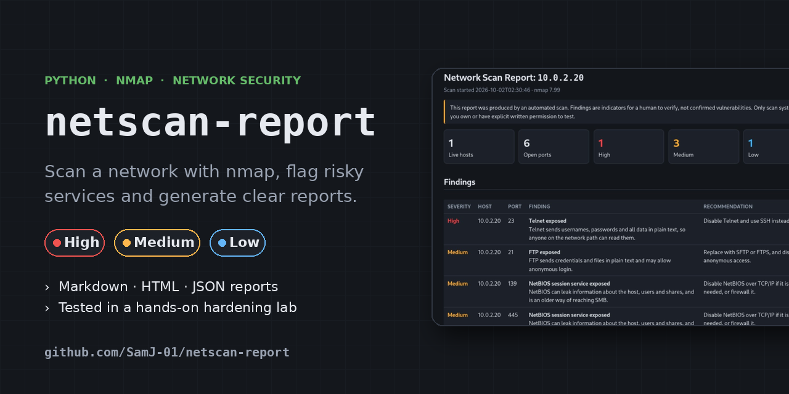
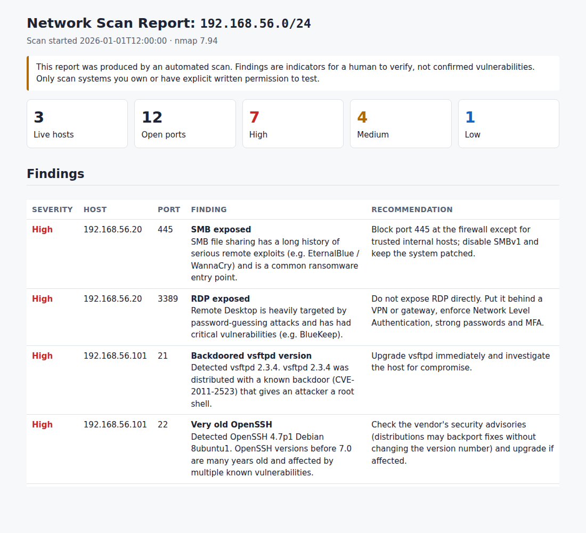

# netscan-report

[](https://github.com/SamJ-01/netscan-report/actions/workflows/tests.yml)




A Python command-line tool that runs an **nmap** scan, risk-rates exposed
services as **High / Medium / Low** with remediation advice, and writes the
results as **Markdown**, **HTML** and **JSON** reports, so findings can be handed
straight to whoever has to fix them.

> [!WARNING]
> ## ⚖️ Legal and ethical use: read this first
>
> **Only run this tool against networks and systems you own, or that you have
> explicit, written permission to test.**
>
> In the UK, unauthorised access to computer material is an offence under the
> **[Computer Misuse Act 1990](https://www.legislation.gov.uk/ukpga/1990/18/contents)**.
> Port scanning someone else's systems without permission can lead to
> investigation under the Act, breach your ISP's or employer's acceptable use
> policy, and get you blocked or reported. Other countries have similar laws
> (for example the US Computer Fraud and Abuse Act).
>
> Safe places to practise:
> - your own home lab (e.g. VirtualBox/VMware VMs such as Metasploitable),
> - `scanme.nmap.org`, which the Nmap project
>   [explicitly allows](http://scanme.nmap.org/) for light testing,
> - a lab or engagement where you have a signed scope / rules of engagement.
>
> The author accepts no responsibility for misuse of this tool.

---

## Contents

- [Why I built this](#why-i-built-this)
- [What it does](#what-it-does)
- [Installation](#installation)
- [Usage](#usage)
- [Sample output](#sample-output) · [Lab write-up](docs/lab-writeup.md)
- [How the risk rating works](#how-the-risk-rating-works)
- [Project structure](#project-structure)
- [Running the tests](#running-the-tests)
- [Limitations](#limitations)
- [Contributing](#contributing) · [Licence](#licence)

## Why I built this

nmap is the standard tool for network discovery, but its raw output is hard to
hand to someone else. In security operations the job isn't finished at
detection: you have to **explain** what is exposed, why it matters and what to
do about it, then verify the fix. This project covers that whole workflow:

- running a scanning tool safely from Python (input validation, no shell injection),
- parsing structured data (nmap's XML output),
- turning raw data into risk-rated findings with recommendations,
- producing reports for different audiences (console, Markdown, HTML, JSON),
- writing tests that run without touching a real network.

## What it does

1. **Takes a target**: a single IP (`192.168.1.10`), a hostname
   (`scanme.nmap.org`) or a CIDR range (`192.168.1.0/24`).
2. **Runs nmap** (`nmap -sV`) to discover live hosts, open TCP ports and
   service/version information.
3. **Flags risky findings**, for example:
   - **High**: Telnet (23), SMB (445), RDP (3389), VNC, Redis/MongoDB exposed,
     the backdoored `vsftpd 2.3.4`, end-of-life Apache/IIS, very old OpenSSH
   - **Medium**: FTP (21), NetBIOS (139), exposed databases, outdated OpenSSH/nginx/MySQL
   - **Low**: unencrypted HTTP, unencrypted POP3/IMAP
4. **Reports** the results:
   - a readable summary in the terminal,
   - `reports/netscan_<target>_<timestamp>.md` (Markdown)
   - `reports/netscan_<target>_<timestamp>.html` (self-contained HTML, works offline)
   - `reports/netscan_<target>_<timestamp>.json` (raw structured results)

## Installation

### 1. Install nmap

netscan-report drives the real `nmap` program, so nmap must be installed and on
your `PATH`.

| OS | Command |
| --- | --- |
| **Kali Linux** | Already installed. Check with `nmap --version` |
| Debian / Ubuntu | `sudo apt update && sudo apt install nmap` |
| Fedora / RHEL | `sudo dnf install nmap` |
| macOS (Homebrew) | `brew install nmap` |
| Windows | Download the installer from <https://nmap.org/download.html> |

### 2. Install netscan-report

Requires **Python 3.9+**. The tool itself only uses the Python standard library.

```bash
git clone https://github.com/SamJ-01/netscan-report.git
cd netscan-report

# Create and activate a virtual environment
python3 -m venv .venv
source .venv/bin/activate        # Windows: .venv\Scripts\activate

# Install the tool (adds the `netscan-report` command) plus pytest
pip install -e .
pip install -r requirements.txt
```

> **Kali / recent Debian users:** these systems block `pip install` outside a
> virtual environment ("externally-managed-environment" error). Using the venv
> above avoids that, and you don't need `sudo` for pip.

You can also run it without installing: `python -m netscan_report <target>`.

## Usage

```text
netscan-report [-h] [-p PORTS] [--fast] [-o OUTPUT_DIR] [--timeout SECONDS]
               [--no-files] [--from-xml FILE] [--no-color] [--version] [target]
```

| Option | Meaning |
| --- | --- |
| `target` | IP address, hostname or CIDR range (max /16) |
| `-p, --ports` | Ports to scan, e.g. `22,80,443` or `1-1024` (default: nmap's top 1000) |
| `--fast` | Only scan the top 100 ports |
| `-o, --output-dir` | Folder for the reports (default: `./reports`) |
| `--timeout` | Give up if the scan runs longer than this many seconds |
| `--no-files` | Print the console summary only |
| `--from-xml` | Build reports from an existing `nmap -oX` file instead of scanning |
| `--no-color` | Plain console output |

### Examples

```bash
# Try it out with the bundled sample data (no scanning at all)
netscan-report --from-xml examples/sample_scan.xml

# Scan one machine in your home lab
netscan-report 192.168.56.101

# Quick scan of your whole home network
netscan-report 192.168.1.0/24 --fast

# Specific ports against the Nmap project's public test host
netscan-report scanme.nmap.org -p 22,80,443 -o scanme-reports

# Turn a scan you already ran with nmap into reports
nmap -sV -oX lab.xml 192.168.56.0/24
netscan-report --from-xml lab.xml
```

You **don't need root/sudo**: as a normal user nmap does a TCP connect scan
(with sudo it switches to a faster SYN scan). Exit codes:
`0` success, `1` error (e.g. nmap missing, invalid target), `2` usage error,
`130` cancelled with Ctrl+C.

## Sample output

These outputs come from the bundled lab data in
[`examples/sample_scan.xml`](examples/sample_scan.xml) (private
VirtualBox addresses, including a deliberately vulnerable Metasploitable VM).

### Console

```text
netscan-report: 192.168.56.0/24
Scan started: 2026-01-01T12:00:00
Live hosts: 3   Open ports: 12   Findings: 7 High, 4 Medium, 1 Low

Host 192.168.56.5
     22/tcp  ssh (OpenSSH 9.9p1)
    443/tcp  ssl/http (nginx 1.26.2)
    (no risky findings)

Host 192.168.56.20 (win-desktop.lab)
    135/tcp  msrpc (Microsoft Windows RPC)
    445/tcp  microsoft-ds
   3389/tcp  ms-wbt-server (Microsoft Terminal Services)
    [HIGH] port 445: SMB exposed
    [HIGH] port 3389: RDP exposed

Host 192.168.56.101 (metasploitable.lab)
     21/tcp  ftp (vsftpd 2.3.4)
     22/tcp  ssh (OpenSSH 4.7p1 Debian 8ubuntu1)
     23/tcp  telnet (Linux telnetd)
     80/tcp  http (Apache httpd 2.2.8)
    139/tcp  netbios-ssn (Samba smbd 3.X - 4.X)
    445/tcp  microsoft-ds (Samba smbd 3.0.20-Debian)
   3306/tcp  mysql (MySQL 5.0.51a-3ubuntu5)
    [HIGH] port 21: Backdoored vsftpd version
    [HIGH] port 22: Very old OpenSSH
    [HIGH] port 23: Telnet exposed
    [HIGH] port 80: End-of-life Apache httpd
    [HIGH] port 445: SMB exposed
    [MEDIUM] port 21: FTP exposed
    [MEDIUM] port 139: NetBIOS session service exposed
    [MEDIUM] port 3306: Database port exposed
    [MEDIUM] port 3306: Outdated MySQL
    [LOW] port 80: Unencrypted HTTP

Reports written:
  markdown reports/netscan_192.168.56.0_24_20260101-120000.md
  html     reports/netscan_192.168.56.0_24_20260101-120000.html
  json     reports/netscan_192.168.56.0_24_20260101-120000.json
```

### HTML report



The full sample reports are in the [`examples/`](examples/) folder:
[Markdown](examples/sample_report.md) ·
[HTML](examples/sample_report.html) ·
[JSON](examples/sample_report.json).

### Lab write-up

See the [lab write-up](docs/lab-writeup.md) for a real before-and-after
assessment: building an isolated VirtualBox lab, scanning a deliberately
insecure server, hardening it, and verifying the fix with a second scan.

## How the risk rating works

All rules live in [`netscan_report/risk.py`](netscan_report/risk.py) as plain
lists, so they are easy to read and extend.

- **Risky service rules** match on the service name nmap detected (so Telnet on
  a non-standard port is still caught). If nmap could not identify the service,
  they fall back to the usual port number.
- **Outdated version rules** compare the detected version against a baseline,
  e.g. `OpenSSH < 9.8` → Medium, `Apache httpd < 2.4` → High (end-of-life).
  Version strings like `7.4p1` are turned into numbers `(7, 4)` so they compare
  correctly (`1.24` is newer than `1.3`).
- Findings are sorted **most severe first**, and each includes a short
  explanation and a recommendation.

| Severity | Meaning |
| --- | --- |
| **High** | Commonly exploited or sends credentials in plain text; fix or restrict soon |
| **Medium** | Increases attack surface or may be missing security fixes; review |
| **Low** | Weak practice worth tidying up |

## Project structure

```text
netscan-report/
├── netscan_report/
│   ├── cli.py        # command-line arguments, error handling, main()
│   ├── scanner.py    # target validation, finding and running nmap
│   ├── parser.py     # nmap XML  ->  Host / Port objects
│   ├── risk.py       # the High/Medium/Low rules
│   ├── report.py     # console, Markdown, HTML and JSON output
│   └── models.py     # dataclasses: Host, Port, Finding, ScanResult
├── tests/            # pytest tests (use sample data, never scan)
├── examples/         # sample nmap XML and the reports generated from it
├── docs/             # screenshot used in this README
├── pyproject.toml    # packaging + `netscan-report` command
└── requirements.txt
```

## Running the tests

```bash
pip install -r requirements.txt
pytest
```

The tests use the saved nmap XML in `examples/` and "monkeypatch" the parts
that would call nmap, so they run in under a second, need no network access and
don't even need nmap installed. They cover XML parsing, every type of risk rule,
target/port validation (including attempts to inject nmap options), error
handling, report rendering (including HTML escaping of hostile service banners)
and an end-to-end CLI run. GitHub Actions runs them on every push.

## Limitations

- **This is not a vulnerability scanner.** Findings are indicators for a human
  to verify. Use dedicated tools (e.g. OpenVAS/Greenbone, Nessus) for full
  vulnerability assessment.
- Version checks are based on what the service *reports*. Linux distributions
  often **backport** security fixes without changing the version number, so an
  "outdated" result may already be patched. Check the vendor's advisories.
- The version baselines in `risk.py` are a snapshot and need updating over time.
- TCP only (no UDP scanning), and IPv4/IPv6 ranges are capped at 65,536 addresses.

## Contributing

Ideas and fixes are welcome. See [CONTRIBUTING.md](CONTRIBUTING.md).

## Licence

Released under the [MIT Licence](LICENSE).
